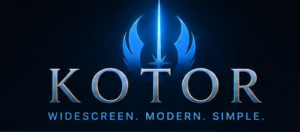

<div align="center">



# KMRP — KOTOR Modern Restoration Patch

**A resolution-aware interface patch for *Star Wars: Knights of the Old Republic* (2003).**

Vanilla KOTOR draws its interface at a fixed pixel size. On a modern display the
menus still work, but the text is tiny, list rows overlap once anything is
enlarged, and several layouts were only ever authored for 640×480. KMRP fixes
that in the engine itself rather than by swapping artwork — 48 resolutions, from
800×600 to 15360×8640.

[Install](#install) · [What it fixes](#what-it-fixes) · [How it works](#how-it-works) · [Build from source](#build-from-source) · [Documentation](#documentation) · [Licence](#licence-and-attribution)

</div>

---

## Install

> [!IMPORTANT]
> KMRP patches a copy of your game executable in place. It is not a Steam
> Workshop item and there is no installer service — you run one program once.

**Requirements**

| | |
| --- | --- |
| Game | *Star Wars: Knights of the Old Republic* (2003 PC release) |
| `swkotor.exe` | The **4,042,752-byte** editable build, SHA-256 `761F9466…C49E9886`. KMRP refuses anything else. |
| OS | Windows with .NET Framework 4.x (shipped with Windows 10/11) |

1. Launch KOTOR once so `swkotor.ini` exists.
2. Run **`KMRP - KOTOR Modern Restoration Patch.exe`**.
3. Pick your resolution and choose **Patch Game**.
4. Restart KOTOR.

To change resolution later, use **Restore Original** first, then patch again.

**What it touches, and how to undo it.** KMRP edits `swkotor.exe`, `swkotor.ini`
and the `Override` folder. Before writing anything it copies the executable and
INI aside and records every Override file it adds or replaces — with hashes — in
`KOTOR_UI_Override_Backup.manifest`. **Restore Original** reverses all three from
those records. The patcher refuses to run against an executable it does not
recognise, and refuses to restore one it did not create.

<details>
<summary><b>Command line</b> (same operations, no window)</summary>

```
KMRP.exe --apply    <source.exe> <output.exe> [WIDTHxHEIGHT]
KMRP.exe --in-place <game.exe> [WIDTHxHEIGHT]
KMRP.exe --restore  <game.exe>
```

`--apply` writes a patched copy and leaves the original alone. Resolution
defaults to 3440×1440 when omitted.

</details>

---

## What it fixes

Every entry below was diagnosed against the executable, and each links to the
full trace. These are engine defects, not preferences — several are vanilla
BioWare bugs that only become visible once the interface is scaled.

| Symptom | Cause | Where |
| --- | --- | --- |
| **Text unreadably small** at high resolution | UI text renders at a fixed pixel size regardless of resolution | [font-scaling](docs/font-scaling.md) |
| **Inventory crash** on items with long descriptions | The line-breaker restarts an unbreakable line at the position it began at, comparing against the start of the *string* rather than the current *line* — it loops until the allocator fails | [font-atlases](reverse-engineering/font-atlases.md) |
| **List rows grow** every time a list is repopulated | `CAurGUIListBox` adds a row *count* to a row *height*, then writes the inflated rect back into reused controls. A vanilla bug, reproduced with an unmodified `.gui` | [listbox-geometry](reverse-engineering/listbox-geometry.md) |
| **Rows and icons stay vanilla-sized** | Row and icon sizes are hardcoded constants, unreachable from any `.gui` | [inventory-item-rows](reverse-engineering/inventory-item-rows.md) |
| **Stack-count numbers vanish** when the font grows | The label is built in the inventory row's `SetRect`, bottom-right-aligned inside the icon box, so scaling the icon leaves it behind | [inventory-item-rows](reverse-engineering/inventory-item-rows.md) |
| **Description text runs under the scrollbar** | The engine truncates each glyph advance and under-measures a line by ~3%; vanilla also left the listbox gutter at 0 on six panes | [listbox-geometry](reverse-engineering/listbox-geometry.md) |
| **Dialogue letterbox too small** on ultrawide | Bar height derived from screen *width* | [font-scaling](docs/font-scaling.md) |
| **HUD minimap not zoomed** to the player | The minimap pans the map under a centre-pinned marker with no clamping | [map](reverse-engineering/map.md) |
| **Message popups clipped** mid-word | An auto-fit loop widens the popup only while it is narrower than a cap authored for 640×480 | [message-popup](reverse-engineering/message-popup.md) |
| **Map marker click offset** from where it is drawn | Hit-test Y disagreed with the draw by 14px | [map](reverse-engineering/map.md) |

---

## How it works

KMRP ships **one verified executable delta plus per-resolution resources**, not a
pile of loose file replacements.

```
 vanilla swkotor.exe ─┐
                      ├─►  gold snapshot  ──►  ResolutionPatch  ──►  your swkotor.exe
     gold delta ──────┘   (all engine fixes)   (rescales constants
     (embedded)                                 for your resolution)

     override-common.zip  ──┐
     gui-<resolution>.zip ──┴──►  Override/   (+ manifest for restore)
```

**The gold snapshot** is a reference executable carrying every engine fix, built
by the scripts in [`tools/`](tools/). The patcher embeds the *delta* between the
clean executable and that snapshot, verifies both hashes, and applies it. Engine
patches are added either as new PE sections (`.kui`, `.klb`, `.kfs`, `.kwl`,
`.ksc`, `.kgs`, `.ktn`, `.kmz`, `.kfg`) holding hand-written x86 stubs, or as
in-place `imm32` rewrites that never change the file length.

**One scaling rule, everywhere.** Font metrics, list rows, icon sizes and popup
geometry all scale by `max(1.0, height / 720)` — 1.00× at 720p, 1.50× at 1080p,
2.00× at 1440p, 3.00× at 2160p. The `.gui` files and the executable constants
are generated from that same rule so they cannot drift apart.

**Fonts are rendered, not shipped.** All 18 atlases are rasterised from vector
outlines at build time and scaled *down* per resolution, so text is crisp at
every size. No font file is redistributed — see
[Licence and attribution](#licence-and-attribution).

---

## Build from source

Building is only needed to develop KMRP; players just run the released
executable.

**Prerequisites**

- Windows with .NET Framework 4.x (`csc.exe` from `v4.0.30319`)
- Python 3 with `pykotor`, and `Pillow` + `numpy` for the asset tools
  (`pip install -r requirements.txt`)
- Two files from your own copy of the game, placed in
  [`build-inputs/`](build-inputs/README.md) — a clean `swkotor.exe`
  (SHA-256 `761F9466…`, verified by the build) and `TexturePacks/swpc_tex_gui.erf`

```powershell
.\build_kmrp.ps1
```

That regenerates all 48 resource archives and compiles the patcher to
`dist/`. Add `-ReuseResources` to skip resource generation and only recompile.

**The project folder is self-contained.** Everything the build reads lives
inside it, so the folder can be moved or copied anywhere. Only the two
game-derived files above have to be supplied, and they are never committed.

> [!NOTE]
> **Game binaries and game resources are never committed.** `.gitignore` blocks
> `*.exe`, `*.erf`, `*.bif`, `*.key` and friends. The gold snapshots live only on
> the build machine; the chain of hashes that identifies them is recorded in
> [docs/font-scaling.md](docs/font-scaling.md) so any of them can be rebuilt and
> verified.

See [CONTRIBUTING.md](CONTRIBUTING.md) for the working rules this project holds
itself to — verifying before and after every executable edit, measuring rather
than eyeballing, and recording what was disproved alongside what worked.

---

## Repository layout

```
.github/              CI workflow, issue and pull request templates, Dependabot
assets/               Build inputs
  branding/           Logo, favicon, and the patcher's UI icons
  fonts/  hd-fonts/   Font sources and the rendered atlases
  override-*/         GUI layouts and artwork installed into the game
docs/                 Build and design documentation
reverse-engineering/  Engine analysis, one document per subsystem
  patch-records/      Machine-readable descriptions of confirmed patches
src/patcher/          The Windows patcher application (C#)
tools/                Python tools that build the gold snapshot and resources
testing/              Test support: virtual-display profiles, geometry diffs
build-inputs/         Files from your own game copy (never committed)
third_party/          Upstream GPL-3.0 GUI layouts, unmodified
archive/              Superseded assets, kept only for reference
releases/             Notes and hashes for past releases
```

## Documentation

| | |
| --- | --- |
| [docs/](docs/) | Build and design documentation — start at [docs/README.md](docs/README.md) |
| [reverse-engineering/](reverse-engineering/) | Engine analysis, one document per subsystem — index at [reverse-engineering/README.md](reverse-engineering/README.md) |
| [CHANGELOG.md](CHANGELOG.md) | What changed, per release |
| [THIRD_PARTY_NOTICES.md](THIRD_PARTY_NOTICES.md) | Upstream work this builds on, and the licensing position |

The reverse-engineering notes are written to be read by someone who was not
there: they record the addresses, the measurements, and — deliberately — the
theories that turned out to be **wrong**, so the same dead ends are not explored
twice.

---

## Licence and attribution

KMRP is distributed under the **GNU General Public License v3.0** — see
[LICENSE](LICENSE). The per-resolution GUI layouts derive from *KOTOR High
Resolution Menus 1.5* by **ndix UR**, which is GPL-3.0, and that licence carries
forward.

Interface artwork derives from the HD menu/UI asset set used in **RaymanGT**'s
3440×1440 release. Full credits, links, and the reasoning behind each decision
are in [THIRD_PARTY_NOTICES.md](THIRD_PARTY_NOTICES.md) — including one
**unresolved** point recorded honestly: the *Old Republic* typeface used for
menu text is marked "free for personal use" by its author, who states it cannot
be licensed further because it reproduces someone else's intellectual property.
KMRP embeds rendered glyph atlases rather than the font file, ships only to
people who already own the game, and the position on record is to remove it if
Lucasfilm objects. **If you redistribute KMRP, that point is yours to weigh.**

*Star Wars: Knights of the Old Republic* is © 2003 BioWare Corp. / LucasArts.
This is an unofficial community patch, not affiliated with or endorsed by
BioWare, LucasArts, Lucasfilm, or Disney. You must own the game.
