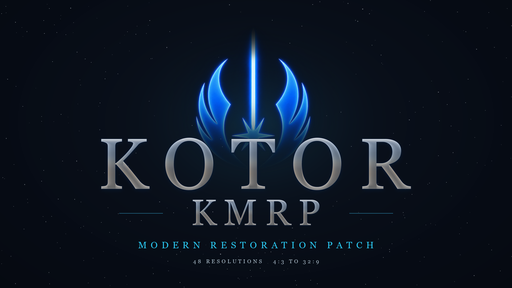
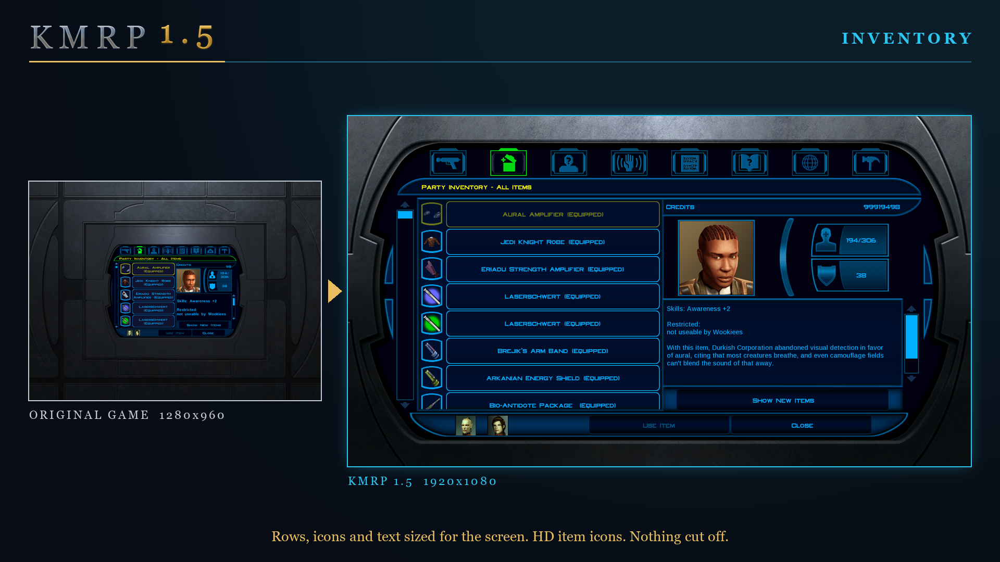
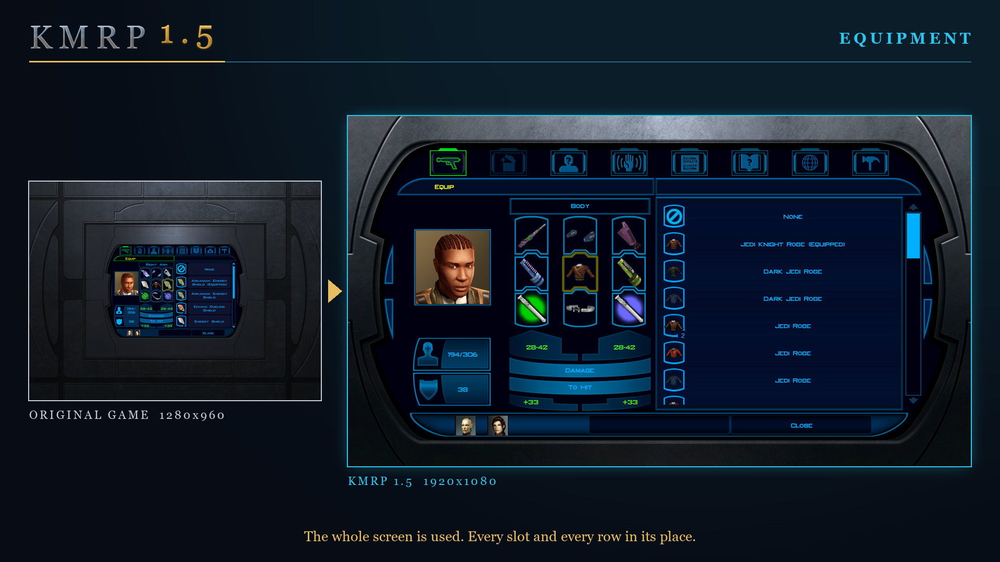
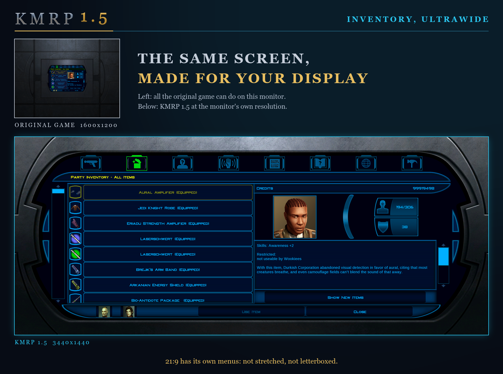
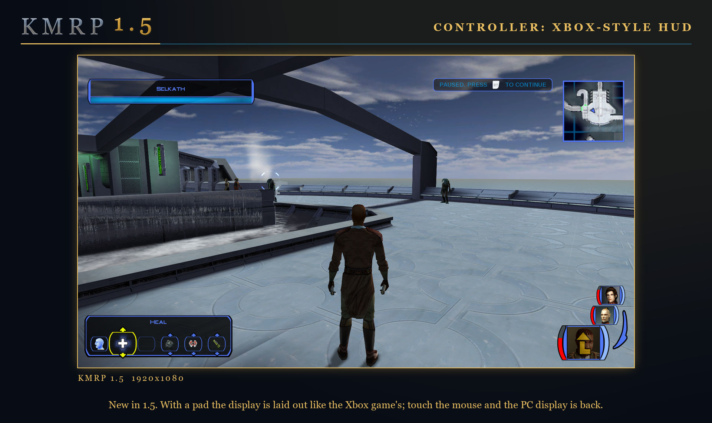
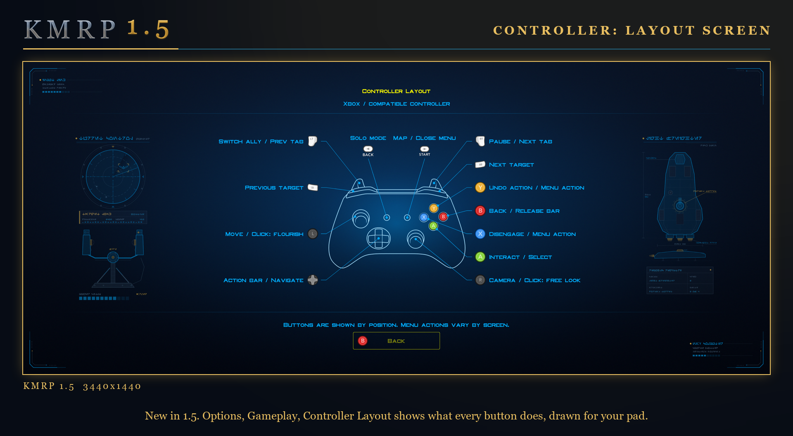
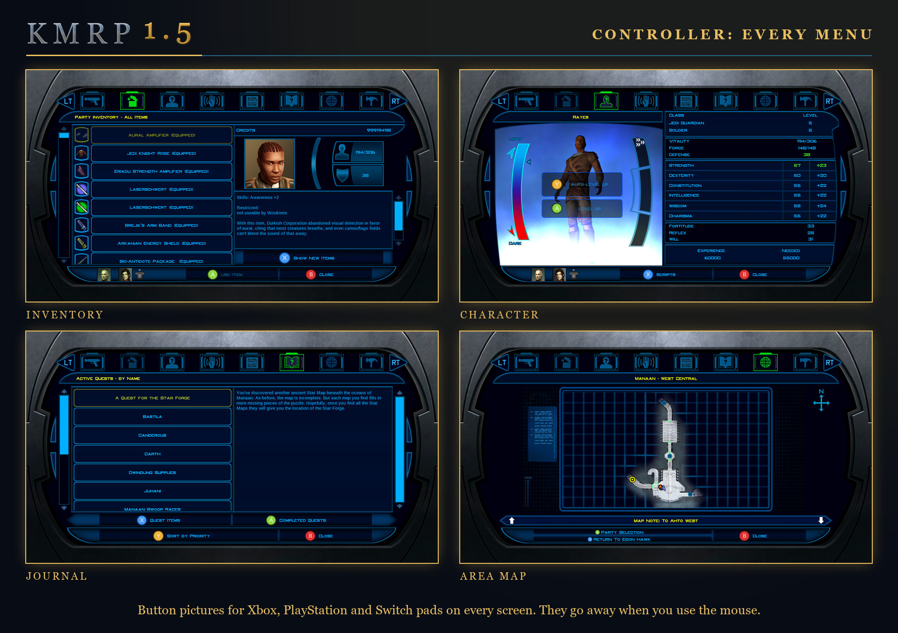
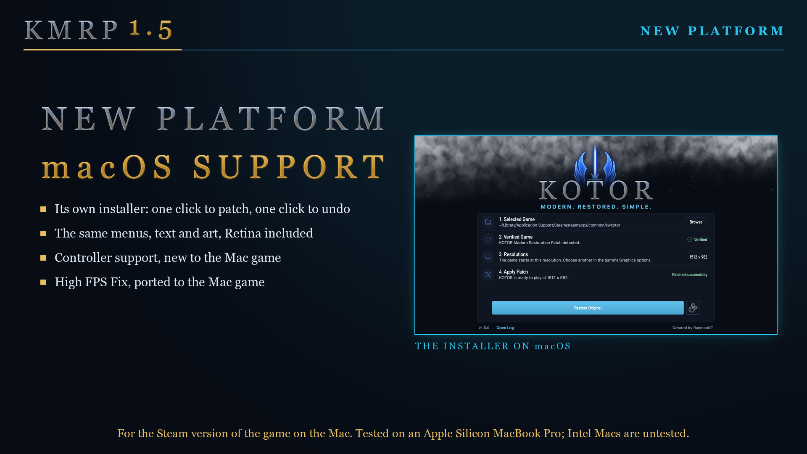
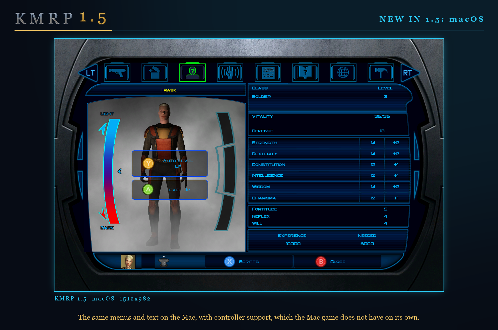

<div align="center">



# KMRP - KOTOR Modern Restoration Patch

**A resolution-aware interface patch for *Star Wars: Knights of the Old Republic* (2003).**

Vanilla KOTOR draws its interface at a fixed pixel size. On a modern display the
menus still work, but the text is tiny, list rows overlap once anything is
enlarged, and several layouts were only ever authored for 640×480. KMRP fixes
that in the engine itself rather than by swapping artwork: 66 resolutions built in,
from 800×600 to 15360×8640, and any other size from 4:3 to 32:9 made when the game
runs at it. The resolution is chosen in the game, with no reinstall.

[Features](#features) · [Install](#install) · [What it fixes](#what-it-fixes) · [How it works](#how-it-works) · [Build from source](#build-from-source) · [Documentation](#documentation) · [Case study](https://rayesdiyab.com/projects/kmrp/) · [Licence](#licence-and-attribution)

</div>

---

## Features

Everything KMRP 1.5 changes compared with the game as it comes from Steam or GOG.
The same list as a before-and-after comparison is in
[docs/features.md](docs/features.md), and with how each item is done in
[docs/features-technical.md](docs/features-technical.md). KMRP changes how the game
looks, fits and controls. It does not change the story, the quests or the balance;
the one change to content is the optional map note fix. The list is the Windows
version's; what differs on the Mac is at its end.

**Resolution and screen**

- The game starts at your display's current resolution. Nothing to choose, no
  widescreen tool to install.
- The game's own Screen Resolution setting lists every resolution your display
  supports, each once, and you switch between them in the game: at once, with no
  restart and no patching again.
- Connect another display and its resolutions appear on their own. If it cannot show
  the resolution you last used, the game starts at that display's own.
- Every shape from 4:3 to 32:9, from 800x600 up to 8K and beyond: 66 common
  resolutions have menus built for them, and any other size gets menus fitted to it.
- The game is shown at its true size whatever Windows display scaling is set to.
- The mouse stays inside the game in fullscreen on a PC with several monitors.

**Text and menus**

- Text grows with the resolution and is drawn sharp for it, not enlarged from a
  small picture.
- Inventory, shop, equipment, quest and other lists have rows and icons sized to
  match the text, each row sitting neatly in its box.
- Item stack numbers stay on their icons.
- Descriptions stay inside their box and clear of the scrollbar, and no longer begin
  with an empty line.
- List rows keep their size instead of growing each time a list is refreshed.
- Message, tutorial and confirmation boxes grow to fit what they say, the "Journal
  Entry Added" and "Items Received" notice among them.
- The tick circles on the options screens grow with the screen.
- Short on-screen notices are the right size at 4K, and the Feedback options no
  longer sit on the scrollbar.
- The black bars in conversations fit the screen.

**Map**

- The area map fills its frame, and fog covers the whole of it.
- You click the map marker you see, and markers scale with the screen.
- The small map in the corner follows your character at every resolution.
- About 250 map notes that have sat in the wrong place since 2003 are where they
  belong (optional, on by default; Derslok's work).

**Movies**

- Movies play at the resolution the game is running at: no switch to 640x480, no
  flicker, no minimised game.
- The whole picture is shown on wide screens, with black bars at the sides, instead
  of being zoomed in and cropped.

**Stability**

- The inventory crash on items with long descriptions is fixed.
- The GOG and disc versions may use twice as much memory (Steam's version cannot
  take this change).
- Rare crashes tied to textures, grass and saving are fixed, with the fixes from
  KOTOR Patch Manager.
- Lighting, fog, reflections, soft shadows and grass work on modern graphics cards
  (optional, on by default; Synchro's K1 Modern Driver Compatibility).
- On NVIDIA setups where the menus flash white, the installer sets the one driver
  option that prevents it, for this game only, and removes it again on undo.

**Above 60 frames per second**

- High FPS Fix installs D3M0's High FPS Fixes, which repairs the timing and
  animation faults the original has above 60 frames per second. It is on by itself
  where your display runs above 60 Hz and off on a 60 Hz display, and its tile in
  the installer says what your display can do.
- The frame rate is chosen in the game, in the same list as the resolution
  ("3440 x 1440 @ 120 Hz"), including the rates above 85 Hz that the original
  hides. Without High FPS Fix the game is held at 60, as long as V-Sync stays on.

**Sharper artwork**

- Party portraits in high quality (MadDerp).
- Item icons in high quality (JackInTheBox; optional, on by default), each drawn at
  the game's own size in its slot.
- Sharper menu art, and feat, power and skill icons that scale with the screen.

**Controller support** (installed by default, can be left out)

- A pad works in the game and in every menu: Xbox, PlayStation and Switch pads and
  the Steam Deck. The button pictures match the pad in your hands and go away when
  you use the mouse or keyboard; the mouse pointer hides while you use the pad.
- Playing: the left stick moves, as slowly or quickly as you push it, and the right
  stick turns the camera; A talks, opens, uses or attacks; a click of the left stick
  flourishes your weapon; the shoulder buttons change target; the left trigger
  switches party member and the right trigger pauses; Start opens the map and closes
  the menus, Back asks about Solo Mode, and a click of the right stick switches free
  look.
- The action bar: the D-pad picks an action and A uses it; the bar keeps your place,
  so A again repeats it, and B lets go. In a fight X disengages and Y removes the
  last queued action.
- Menus: the D-pad or left stick moves through every screen, and holding a direction
  keeps moving; A selects, B goes back; the triggers switch tabs, shown as arrows
  named for your pad; the right stick scrolls long text. An A picture follows the
  selection, down the main menu, on Yes or No and on the reply you are about to give.
- Screens: a click of the right stick switches the party member on Character,
  Equipment, Inventory and Abilities; X switches between Skills, Powers and Feats;
  A is Level Up and Y is Auto Level Up; in the Journal A switches between active and
  completed quests and Y changes the order; in a shop A buys or sells and X switches
  between the two lists; on the options screens D-pad left and right change a
  setting and Y restores the defaults.
- Conversations, character creation, level-up, shops, containers, saving and
  loading, the options and Pazaak's wager need no mouse. In character creation the
  D-pad picks the portrait, D-pad left and right set attributes and skills, and Y is
  Recommended or Random Name (typing a name of your own needs the keyboard). Notices
  close with A. A or Start skips a movie, and the game comes to the front at start
  so that works without a mouse click.
- A Controller Layout screen under Options, Gameplay shows what every button does.
- Rumble: off, the original Xbox version's (with the rumble BioWare made for the PC
  and never switched on), or an enhanced one that adds lightsabers igniting, humming
  and clashing, blaster recoil, hits taken and explosions. Silent in menus and while
  paused. Mode and strength are set in `kmrp-controller.ini` beside the game.
- Xbox-style HUD while you play with a pad: the action menu at the bottom left, the
  target at the top left, the party at the bottom right, the minimap at the top
  right, with frames drawn sharp for your resolution, a pause notice that shows your
  pad's trigger, and a combat-mode line across the top. The PC display is back the
  moment you use the mouse or keyboard, and the Xbox layout can be switched off
  (`Style=PC` in `kmrp-controller.ini`).
- Controller support is a patch of its own and installs without the rest of KMRP.
- It works with other interface and widescreen mods: it puts no file into the
  game's folders, and its button pictures and HUD are placed while the game runs,
  to fit whatever interface is installed. Tried on the unchanged game, with KMRP,
  and beside Scaled Kotor 1.3.1, the widescreen patch by J and Vriff.

**Installing and removing**

- One program: run it, press Start Patching, play. It finds the Steam or GOG game by
  itself and says which version it found.
- The game's main file is not rewritten. Steam's copy stays exactly as Steam
  installed it, and you start the game the way you always do.
- Nothing goes into the `Override` folder and no file of another mod is replaced.
  Tested with the KOTOR 1 Community Patch and KOTOR 1 Restoration, in either order.
- Restore Original undoes everything KMRP did, file by file.
- Options behind the gear button: controller support, graphics-card compatibility,
  the map note fixes, the HD item icons, High FPS Fix and diagnostic logs. Your
  choices are remembered, and Restore Defaults puts them back.
- An older KMRP is replaced when you patch again, and the installer tells you when a
  newer one is out.
- KOTOR Patch Manager users get KMRP as two patches that sit beside their others,
  and D3M0's High FPS Fixes as a third while High FPS Fix is on. Where KOTOR Patch
  Manager already looks after the game, the installer hands the patches to it.
- Everything the installer does can also be run from the command line.
- KMRP replaces UniWS and other widescreen patchers, High Resolution Menus, a
  separate 4 GB patch, and KOTOR Patch Manager's own 4 GB, texture, grass, save-game
  and Better Movie Playback patches. Do not install those alongside it.

**On the Mac** (new in 1.5: the Steam version, with its own installer)

- The same menus for your resolution, text, lists, icons, popups, map and note
  fixes, conversation bars, crash fix, HD art and all of controller support. The Mac
  game has no controller support at all without KMRP.
- Retina: the game starts at the resolution macOS is set to, and the display's full
  Retina resolution is in the game's list.
- Five options: controller support, the map note fixes, the HD item icons, High FPS
  Fix (KMRP's port of D3M0's patch to the Mac game) and diagnostic logs.
- It builds on FTD's Widescreen Patch and Stray Bug Fixes, which the installer
  brings with it.
- Not on the Mac, because they are fixes for Windows: display scaling, the extra
  memory, the NVIDIA setting, Modern Driver Compatibility, the mouse kept inside the
  game, and the movie fixes.

**Where it works.** Windows: the Steam, GOG and disc 1.03 versions. macOS: the Steam
version ([Other platforms](#other-platforms)). Linux with Proton: tested by the
maintainer on Ubuntu, with the stable Proton and Proton Experimental. Steam Deck:
not tested on the device.

---

## Install

> [!IMPORTANT]
> You run one program once, then start the game as you always do -- from Steam,
> or from `swkotor.exe`. KMRP does not rewrite the game's executable: its engine
> changes are applied in memory each time the game starts, by KOTOR Patch
> Manager's runtime, which the installer puts beside the game.

**Requirements**

| | |
| --- | --- |
| Game | *Star Wars: Knights of the Old Republic* (2003 PC release) |
| `swkotor.exe` | One of three builds, and KMRP refuses every other: **Steam's** (`34E6D971…A439F34C88`), **GOG's** (`9C10E045…DEA91435`), or the **4,042,752-byte editable 1.03 build** (`761F9466…C49E9886`). GOG's and the editable build are also accepted with only the standard Large Address Aware bit already set. |
| OS | Windows with .NET Framework 4.x (shipped with Windows 10/11). Linux with Proton works on Ubuntu, as tested by the maintainer; the Steam Deck is untested. See [Other platforms](#other-platforms). |

1. Launch KOTOR once so `swkotor.ini` exists.
2. Download **`KMRP-Windows-1.5.0.exe`** from the [1.5.0 release](https://github.com/RayesDiyab/KMRP-KOTOR-Modern-Restoration-Patch/releases/tag/v1.5.0) and run it. It finds Steam's KOTOR by itself,
   in any Steam library, and otherwise GOG's; **Browse** picks another `swkotor.exe`.
3. Choose **Start Patching**. There is no resolution to pick: the game starts at
   your display's current resolution, and every resolution your display supports is
   offered in the game, under Options, Graphics, Screen Resolution. Connect another
   display, a 4K television for one, and the game offers that display's resolutions.
   The same list sets the frame rate: with High FPS Fix it offers every refresh
   rate of your display ("3440 x 1440 @ 120 Hz") and the game starts at the
   highest; without it the game is held at 60.
4. Start KOTOR as usual.

**Options.** Advanced Settings (the gear) turns off Modern Driver Compatibility, the
area-map marker fixes, the HD item icons and controller support, each on its own,
and turns on D3M0's High FPS Fix and debug
logs, which are off unless you are asked for them with a bug report. To change one
later, use **Restore Original**, then patch again.

**Undo.** **Restore Original** reverses every change KMRP made, from the hashes it
recorded when it installed; a file changed since is left alone, and said so.

**Updating.** Patching over an older KMRP replaces it, whichever way that version
installed itself. If Steam verifies the game's files, it puts its own `binkw32.dll`
back and KMRP stops loading: patch again.

**What it changes** compared with the unmodified game is listed for players in
[docs/features.md](docs/features.md).

### Controller support

`KOTOR 1 Native Controller Mod + Xbox HUD.kpatch` is KMRP's controller support as a
patch of its own: the pad in the game and in every menu, button prompts for Xbox,
PlayStation, Switch and Steam Deck pads, rumble, and the Controller Layout screen.
The installer installs it beside KMRP's patch while Native Controller Support (the
first tile of Advanced Settings; "Controller Support" until 2026-10-09) is on. It
also runs in a game that has no KMRP, on the interface the game ships or beside
another widescreen patch: it needs no other patch, writes nothing to `Override`,
and places its prompts from the running game (seen beside KMRP at 3440x1440, and
beside Scaled Kotor 1.3.1 at 1920x1080 and 3440x1440).

It also brings an **Xbox-style HUD**, on by default: the in-game HUD laid out as
the original Xbox version's while the pad is in use, and the game's own HUD back as
soon as the mouse or keyboard is used. To keep the game's own HUD with the pad too,
set `Style=PC` under `[Hud]` in `kmrp-controller.ini` beside the game. See
[docs/controller-standalone.md](docs/controller-standalone.md) and
[docs/controller-xbox-hud.md](docs/controller-xbox-hud.md). Windows only.

### With KOTOR Patch Manager

KMRP is two KPM patches, each working without the other: `KMRP.kpatch` and the
controller patch above. Both combine with other KPM patches. With High FPS Fix on,
the installer adds a third beside them, D3M0's `HighFpsFixes.kpatch`, as its author
released it.

- The installer carries both and puts them in KPM's patch folder, the controller
  patch only while Native Controller Support is on, the High FPS Fixes patch only
  while High FPS Fix is on. If KPM's runtime is already in the game
  folder, the installer leaves the patches to KPM and says where the files are.
- In KPM, tick `KMRP`, and the controller patch for the pad, then Apply and Launch.
  KMRP includes the 4 GB and memory fixes, so KPM's own ones stay unticked.
- KMRP's options are map notes and HD item icons, on, and debug logs, off. KPM 0.7.1 has no patch
  options and installs it that way.
- On Steam, switch KPM to its proxy deployment and start the game from Steam.
- With KPM 0.7.1, tick *Use library proxy* in KPM before pressing Apply (press
  Uninstall All if it is greyed out), or only KPM's Launch starts the game patched.
- `--export-kpm-patches <folder>` writes the `.kpatch` files out for sharing.

[docs/kpm-edition.md](docs/kpm-edition.md) describes both ways.

### Other platforms

**macOS (Steam), new in KMRP 1.5.** A separate installer, `KMRP-macOS-1.5.0.dmg`, for the
Aspyr build on Steam, made from the same resources as this one: the same interface for
every resolution, fonts, art and engine fixes, and controller support, which the Mac game
does not have on its own. How to install it is in the package's own README
([macos/PLAYER-README.md](macos/PLAYER-README.md)); what it writes, byte for byte, and what
was and was not tested is in [macos/README.md](macos/README.md). Tested on Apple
Silicon and on Intel Macs.
Its two patch files, `KMRP-macOS.kpatch` and
`KOTOR 1 Native Controller Mod + Xbox HUD (macOS).kpatch`, work on the Mac game only, and
the Windows files named above on Windows only.

**Linux with Proton.** Launch the installer inside the game's Proton environment
with `protontricks-launch --appid 32370`, and use the same route for restore.
Tested by the maintainer on Ubuntu, with the stable Proton and with Proton
Experimental, on a development build of 1.5 that already worked as the release
does (nothing in `Override`, the resolution chosen in the game): it installed and
played. The released build itself has not been run again under Proton, and other
distributions are untested.

**Steam Deck.** Not tested on the device. It runs the game through the same
Proton, so the same steps apply. The commands and the test record for both are in
the [Linux, Proton, and Steam Deck guide](docs/linux-proton-steam-deck.md).

### What the installer touches

| Where | What |
| --- | --- |
| Beside `swkotor.exe` | KOTOR Patch Manager's runtime, laid out as KPM's own proxy deployment: KPM's `binkw32.dll` proxy in place of the game's (renamed `binkw32Hooked.dll`), `KotorPatcher.dll` and `patch_config.toml`. |
| `patches\` | `kmrp.dll`, KMRP's module, with the engine changes and every resolution's interface files; `kmrp-controller.dll` while Native Controller Support is on; and `high-fps-fixes.dll` while High FPS Fix is on. |
| `configs\` | `kmrp.ini` and `kmrp-controller.ini`, the options the patches were installed with. |
| `kmrp-controller.ini` | Beside the game: rumble and HUD style, yours to edit. Written only when it is not there. |
| `swkotor.ini` | The starting resolution, and the game's own frame-rate lines: `AllowHighMonitorFrequency` and `RefreshRate` (the display's highest with High FPS Fix; 60 without it, with `V-Sync=1`). Its prior contents are kept in a verified backup. |
| `swkotor.exe` | On GOG's and the editable build, the standard Large Address Aware flag: one bit, with a backup of the unmodified file in KPM's own format. **Steam's is never changed.** |
| `Override` | Nothing. |
| Windows | A per-user compatibility value that marks the game DPI-aware ([details](docs/windows-dpi-scaling.md)). |
| NVIDIA driver | Only where the global present method would show half-drawn frames: **Prefer native** for `swkotor.exe` ([details](docs/nvidia-present-method.md)). |
| Optional | *Modern Driver Compatibility* adds its loader (`dinput8.dll`) and payload beside the game. |

Every change is recorded with hashes in manifests beside the game, and **Restore
Original** reverses each from those records. In a game folder where KOTOR Patch
Manager's runtime is already installed, the installer installs no runtime and does
not touch `swkotor.exe`: KPM applies KMRP's patches.

<details>
<summary><b>Command line</b> (same operations, no window)</summary>

```
KMRP.exe --in-place <game.exe> [WIDTHxHEIGHT]
KMRP.exe --restore  <game.exe>
KMRP.exe --export-kpm-patches <folder>
KMRP.exe --apply    <source.exe> <output.exe> [WIDTHxHEIGHT]
```

The resolution given to `--in-place` is where `swkotor.ini` starts the game.
`--apply` writes a patched copy and leaves the original alone: a reference
executable for one resolution, which the installer does not install.

</details>

<details>
<summary><b>On the version number</b></summary>

The current release is **KMRP 1.5**, published on 2026-10-09 and tagged
[v1.5.0](https://github.com/RayesDiyab/KMRP-KOTOR-Modern-Restoration-Patch/releases/tag/v1.5.0),
for Windows and, for the first time, for macOS. Its installers report 1.5.0. The
first public release was **KMRP 1.0**, published on 2026-09-04 and tagged
[v1.0.0](https://github.com/RayesDiyab/KMRP-KOTOR-Modern-Restoration-Patch/releases/tag/v1.0.0).
Internal development numbers appear in [`CHANGELOG.md`](CHANGELOG.md): 2.0.0 to
2.9.x were private builds, 2.10.0 is 1.0 (that tag remains on the same commit, and
1.0's Properties report 2.7.0.0, a mislabel), and 2.11.0 was 1.5's number until it
was relabelled 1.5.0. One 2.0.0 build left the machine before 1.0; its hash is
recorded in [`releases/universal-v2.0.0/`](releases/universal-v2.0.0/).

</details>

---

## What it fixes

The full list of what changes is under [Features](#features) above. The table
below is the engine defects: every entry was diagnosed against the executable, and each links to
the full trace. Several are vanilla BioWare bugs that only become visible once the
interface is scaled.

| Symptom | Cause | Where |
| --- | --- | --- |
| **Text unreadably small** at high resolution | UI text renders at a fixed pixel size regardless of resolution | [font-scaling](docs/font-scaling.md) |
| **Inventory crash** on items with long descriptions | The line-breaker restarts an unbreakable line at the position it began at, comparing against the start of the *string* rather than the current *line* -- it loops until the allocator fails | [font-atlases](reverse-engineering/font-atlases.md) |
| **List rows grow** every time a list is repopulated | `CAurGUIListBox` adds a row *count* to a row *height*, then writes the inflated rect back into reused controls. A vanilla bug, reproduced with an unmodified `.gui` | [listbox-geometry](reverse-engineering/listbox-geometry.md) |
| **Rows and icons stay vanilla-sized** | Row and icon sizes are hardcoded constants, unreachable from any `.gui` | [inventory-item-rows](reverse-engineering/inventory-item-rows.md) |
| **Stack-count numbers vanish** when the font grows | The label is built in the inventory row's `SetRect`, bottom-right-aligned inside the icon box, so scaling the icon leaves it behind | [inventory-item-rows](reverse-engineering/inventory-item-rows.md) |
| **Description text runs under the scrollbar** | The engine truncates each glyph advance and under-measures a line by ~3%; vanilla also left the listbox gutter at 0 on six panes | [listbox-geometry](reverse-engineering/listbox-geometry.md) |
| **Dialogue letterbox too small** on ultrawide | Bar height derived from screen *width* | [font-scaling](docs/font-scaling.md) |
| **HUD minimap not zoomed** to the player | The minimap pans the map under a centre-pinned marker with no clamping | [map](reverse-engineering/map.md) |
| **Message popups clipped** mid-word | An auto-fit loop widens the popup only while it is narrower than a cap authored for 640×480 | [message-popup](reverse-engineering/message-popup.md) |
| **HUD notifications oversized at 4K**, and **Feedback option circles on the scrollbar** | Short-lived HUD controls were scaled from screen width instead of the common height rule; the Feedback list drew each circle at the row's very edge, which is where its left scrollbar ends, and now keeps a gutter | [universal resolution math](docs/universal-resolution-math.md#reported-4k-layout-repairs) |
| **Out-of-memory failures near the 2 GB process ceiling** | The 32-bit executable did not declare that it can use addresses above 2 GB; KMRP now sets the standard PE Large Address Aware bit | [large-address-aware](reverse-engineering/large-address-aware.md) |
| **Movies trigger a 640×480 mode switch, minimize, or lose focus** | Full-screen Bink playback has two resolution pairs independent of the normal render size; KMRP writes the resolution the game is running at into both | [movies](reverse-engineering/movies.md) |
| **Movies cropped** on wide screens -- a 640×480 logo drawn 3440×2580 at 3440×1440 | Retail scales a movie by the screen *width* alone; KMRP fits it by whichever of width and height runs out first | [movies](reverse-engineering/movies.md) |
| **Map marker click offset** from where it is drawn | The hit test centred the map canvas in the window, while the control that crops it is placed by the marker overlay -- 141px out horizontally | [map-markers](reverse-engineering/map-markers.md) |
| **Unfogged strip** down the right of the area map | The map picture is drawn onto a canvas wider than the overlay the fog grid covers, and nothing cropped the surplus | [area-map-surface](reverse-engineering/area-map-surface.md) |
| **250 map notes in the wrong place** | A 2003 content bug: the notes' stored world positions do not match their subjects | [map-markers](reverse-engineering/map-markers.md) |

---

## What it looks like

The original game beside KMRP 1.5, every frame whole and uncropped. The original
is shown at the largest size it offers on that monitor.



Rows, icons and stack counts scale with the text, and the screen is used.



Every slot and every row has its place, and the whole screen is used.

It holds at 21:9 as well: every resolution is made from the same rules, not
hand-tuned one at a time.



**New in 1.5: controller support.** With a pad the display is laid out like the
Xbox game's, every menu shows the buttons of the pad in your hands, and a new
screen under Options, Gameplay shows what each one does.







**New in 1.5: macOS.** The Steam version of the game on the Mac has its own
installer and the same menus, text and controller support.





The whole 1.5 set, with the cover, is the release's press kit:
[`releases/v1.5.0/press-kit/`](releases/v1.5.0/press-kit/). The 1.0 pictures are in
[`assets/screenshots/`](assets/screenshots/).

---

## How it works

KMRP builds its engine fixes from tracked source and ships them, with every
resolution's interface resources, inside one module.

```text
 source patch sites + x86 assembly builders
     -> Windows engine template --------------------.
 override-common.zip + resolution layouts -> bank --+-> kmrp-native.dll -> KMRP.kpatch
 game starts -> KPM proxy/runtime -> patches\kmrp.dll
     -> verifies original instructions -> applies fixes in memory for the size in use
     -> unpacks that size's files to a private cache the game reads
     -> a resolution change in the game: both again, for the new size
```

The Windows build uses [`tools/build_windows_engine.py`](tools/build_windows_engine.py)
to assemble the injected code and its original-byte guards. It needs neither a
clean 1.03 executable nor a patched gold snapshot. KMRP's module fills the
template in for the resolution the game is running at, and validates the decrypted
game instructions before applying any memory changes. This serves the supported Steam,
GOG and editable CD 1.03 variants through the same patch recipe.

The eleven code/data pages retain their existing layout and relocations. The
[historical byte inventory](reverse-engineering/binary-inventory.md) records the
sites; the [source build reference](docs/windows-engine-source.md) explains the
new build and verification. Original game files remain hash-validated during
installation, and backup/restore ownership remains unchanged. On the editable
executable the installer still manages the existing 4 GB header flag; Steam's
executable stays unchanged.

**Each interface file is stored once.** Most of the 66 resolutions' files are
the same bytes at several resolutions, so the module embeds them as one bank
of distinct files, compressed, with an index per resolution, and unpacks the set
of the size in use. The bank also leaves out every file the module can write itself, exactly, from
its blend table (most layouts and badges of most sizes), and checks each file it
writes against the set's index. The installer carries the module once, inside
`KMRP.kpatch`, and the controller patch beside it, and is about 140 MB.

**One scaling rule, everywhere.** Font metrics, list rows, icon sizes and popup
geometry all scale by `max(1.0, height / 720)` -- 1.00× at 720p, 1.50× at 1080p,
2.00× at 1440p, 3.00× at 2160p. The `.gui` files and the executable constants
are generated from that same rule so they cannot drift apart.

**Fonts are rendered, not shipped.** All 18 atlases are rasterised from vector
outlines at build time, once per resolution at that resolution's own scale, so
one atlas texel lands on one screen pixel and nothing is resampled. 15360×8640
is the one exception: its scale-12.0 atlas is larger than the baker can produce.
No font file is redistributed -- see
[Licence and attribution](#licence-and-attribution).

---

## What else it installs

Alongside its own fixes, KMRP bundles work by other authors, each with that
author's permission. All of it is optional or deferential -- none of it silently
overwrites a mod you installed yourself.

| Component | Author | Licence | Optional |
| --- | --- | --- | --- |
| [K1 Modern Driver Compatibility](https://codeberg.org/Synchro/kotor-modern-driver-compatibility) 1.2.0 | Synchro | MPL-2.0 | **Yes** -- Advanced Settings |
| Area map marker corrections (250 notes) | Derslok | GPL-3.0 | **Yes** -- Advanced Settings |
| Controller support, based on [KPM – Xbox Controls for KOTOR 1](https://github.com/scopeking0117-alt/KPM-Xbox-Controls-K1) 1.2 | Saul0097 / KMRP | MIT, inherited from KOTOR Patch Manager, with each author's permission (his own licence file pending); SDL zlib | **Yes, on by default** -- Advanced Settings |
| Party Portraits | MadDerp | -- | No |
| KOTOR 1 HD Icon Pack 1.0 | JackInTheBox | -- | **Yes** -- Advanced Settings |
| [High FPS Fixes](https://github.com/gnw-d3m0/D3M0s-KPatches) 1.0.1 | D3M0 | MIT | **Yes, on where the display runs above 60 Hz** -- Advanced Settings |

**Advanced Settings**, the button beside *Start Patching*, is six tiles: Native
Controller Support, Modern Driver Compatibility, Area Map Marker Fixes, HD Item
Icons, High FPS Fix and Debug Logs. The first four are on by default, each can be
turned off on its own, and *Restore Defaults* puts every tile back. *High FPS Fix* installs D3M0's High
FPS Fixes as a third patch beside KMRP's two (timing and animation fixes for play
above 60 frames per second); it is on by itself where your display runs above
60 Hz and off on a 60 Hz display, until you set it yourself. *Debug Logs* is off
by default: it makes KMRP write diagnostic log files beside the game. The choices
are remembered in `%LOCALAPPDATA%\KMRP\settings.json`.

**Updates.** When its window opens, the installer asks GitHub whether a newer
KMRP has been released. If one has, it offers the Deadly Stream page or a skip.
*Don't remind me again for* that version silences it, and only it. What the
request sends is in
[SECURITY.md](SECURITY.md).

**Driver compatibility** is two files dropped beside `swkotor.exe`; it never
edits the executable, and KMRP removes them on restore. What it changes, and the
check showing its eight patch sites do not collide with any of the 742 byte
positions KMRP's installer writes at any resolution, is in
[docs/third-party-driver-compat.md](docs/third-party-driver-compat.md).

**KMRP's runtime** is KOTOR Patch Manager's (MIT), built from the
[submodule](third_party/Kotor-Patch-Manager) and loaded through KPM's own
`binkw32.dll` proxy, with KMRP's two KPM patches -- the same ones the
installer carries as `.kpatch` files for KPM's app. KMRP's own patch is installed
every time: KMRP's engine changes, three memory-safety fixes, mouse confinement,
the movies, the movie bars and the status summary's layout.
**Controller support** is the second patch, `kmrp-controller`, installed while
Native Controller Support is on: its module, its hooks in `patch_config.toml` after
KMRP's, and `configs\kmrp-controller.ini`. The marker option and debug logs are
the two options of KMRP's patch, `map-notes` and `debug-logs`; the installer writes
the two choices into `configs\kmrp.ini` in the game folder (the `[Patch Options]`
section), where a KOTOR Patch Manager with patch options records them too.
Xbox devices retain XInput; SDL3/HIDAPI supplies mapped non-Xbox devices to the
same normalized state. Input still travels through KOTOR's retained controller
events rather than synthetic keys. Options → Gameplay also gains a live
Controller Layout screen. An existing `patch_config.toml`, `KotorPatcher.dll` or
`binkw32Hooked.dll` that KMRP did not write -- KOTOR Patch Manager's own install
-- is left alone, and KMRP is installed for KPM instead. Exact files, mappings, hooks,
dynamic prompt families, layout screen, and the remaining hardware/Proton test
matrix are in [docs/controller-support.md](docs/controller-support.md) and
[docs/controller-layout.md](docs/controller-layout.md).

**KMRP's files take precedence, and replace nothing.** The module's files are
read from its own cache ahead of `Override`, so no file of yours is overwritten
or moved, and removing KMRP leaves `Override` exactly as it was. Measured for the
main menu's layout on 2026-10-04; a content mod's portrait or icon of the same
name has not been compared.

**Tested against** KOTOR 1 Community Patch 1.10.0 and KOTOR 1 Restoration 1.2:
neither ships `.gui` files, neither touches `swkotor.exe`, and neither patches
`tutorial.2da`, the only 2DA KMRP supplies (made from the game's own table by the
module when the game starts). K1CP replaces two icons the HD Icon Pack
also provides. The order in which you install content mods and KMRP no longer
matters, since KMRP writes nothing into `Override`. Do not also install UniWS, High Resolution
Menus, or a separate 4 GB patch. KOTORganizer users should finish Sync and then
run KMRP manually against the real game folder; see the full
[mod-build compatibility and install-order guide](docs/mod-build-compatibility.md).

---

## Build from source

Building is only needed to develop KMRP; players just run the released
executable.

**Prerequisites**

- Windows with .NET Framework 4.x (`csc.exe` from `v4.0.30319`)
- Python 3 with `pykotor`, `capstone`, and `Pillow` + `numpy` for the asset tools
  (`pip install -r requirements.txt`)
- Visual Studio Build Tools (MSVC, x86) for the controller module and KOTOR
  Patch Manager's runtime, which the build compiles from the submodule
  (`git submodule update --init`; [src/kpm-runtime](src/kpm-runtime/README.md))
- Network access on the first build: `tools/prepare_sdl3.ps1` downloads the
  pinned SDL 3 SDK into `build/deps` and checks its hash
- `TexturePacks/swpc_tex_gui.erf` from your own game, placed in
  [`build-inputs/`](build-inputs/README.md). Steam's texture pack is sufficient;
  no game executable is a build input.
- The game's own 84 layout files in `build-inputs/vanilla-gui`, for the controller
  patch the installer carries since 2026-10-05: written once by
  `python tools\build_controller_assets.py --extract <game folder>` from an
  unmodified game.

```powershell
.\build_kmrp.ps1
```

That regenerates all 66 resource archives and compiles the patcher to
`dist/`. Add `-ReuseResources` to skip regenerating the interface archives;
engine assembly, native compilation, pooling and KPM packaging still run.

The build assembles the Windows engine template and compiles KMRP's module, the
controller patch's module and KPM's runtime itself. Optionally generate per-resolution font sets in
`build/fonts` with `tools/build_font_scale_sets.py` first. Without them the build
warns and each resolution falls back to the shared atlas.

The source-only engine regression can run without game files:

```powershell
python testing/regression/Test-WindowsEngineSource.py --csc C:\Windows\Microsoft.NET\Framework\v4.0.30319\csc.exe
```

**The project folder is self-contained.** The texture pack and the extracted
layout files are the only required game-derived files supplied from outside, and
are never committed. The build
creates its engine template and native modules inside the project.

> [!NOTE]
> **Game binaries and game resources are never committed.** `.gitignore` blocks
> `*.exe`, `*.erf`, `*.bif`, `*.key` and friends. The gold snapshots live only on
> the build machine; the chain of hashes that identifies them is recorded in
> [docs/font-scaling.md](docs/font-scaling.md) so any of them can be rebuilt and
> verified.

See [CONTRIBUTING.md](CONTRIBUTING.md) for the working rules this project holds
itself to -- verifying before and after every executable edit, measuring rather
than eyeballing, and recording what was disproved alongside what worked.

---

## Repository layout

```
.github/              CI workflow, issue and pull request templates, Dependabot
assets/               Build inputs
  branding/           Logo, favicon, and the patcher's UI icons
  fonts/  hd-fonts/   Font sources and the rendered atlases
  override-*/         GUI layouts and artwork the patch's module carries
docs/                 Build and design documentation
reverse-engineering/  Engine analysis, one document per subsystem
  patch-records/      Machine-readable descriptions of confirmed patches
src/patcher/          The Windows patcher application (C#)
src/controller-native/ KMRP's module and the controller patch's (C++), loaded by KOTOR Patch Manager
src/kpm-runtime/      Builds KOTOR Patch Manager's runtime and proxy from the submodule
tools/                Python tools that build the engine recipe, the patches and resources
testing/              Regression tests, controller harnesses, virtual-display profiles
build-inputs/         Files from your own game copy (never committed)
third_party/          Upstream inputs: GUI layouts, bundled mods, glyph art, a font
archive/              Superseded assets, kept only for reference
releases/             Notes and hashes for past releases
```

## Documentation

| | |
| --- | --- |
| [docs/](docs/) | Build and design documentation -- start at [docs/README.md](docs/README.md) |
| [reverse-engineering/](reverse-engineering/) | Engine analysis, one document per subsystem -- index at [reverse-engineering/README.md](reverse-engineering/README.md) |
| [CHANGELOG.md](CHANGELOG.md) | What changed, per release |
| [THIRD_PARTY_NOTICES.md](THIRD_PARTY_NOTICES.md) | Upstream work this builds on, and the licensing position |

The reverse-engineering notes are written to be read by someone who was not
there: they record the addresses, the measurements, and -- deliberately -- the
theories that turned out to be **wrong**, so the same dead ends are not explored
twice.

---

## Community and media coverage

Coverage of **KMRP 1.0**, the first release. Thank you to both.

| | By | |
| --- | --- | --- |
| Video | **LucianDarth** | [Patch KOTOR with 1 Installer \| KOTOR Modern Restoration Patch](https://www.youtube.com/watch?v=IRK-3XjTKjU) |
| Article | **SWTOR Strategies** | [While We Wait for the KOTOR Remake, Modders Just Fixed the Original for Modern PCs](https://swtorstrategies.com/2026/09/kotor-modern-restoration-patch.html) |

Both describe 1.0. What has changed since is under [Features](#features).

---

## Licence and attribution

KMRP is distributed under the **GNU General Public License v3.0** -- see
[LICENSE](LICENSE). The per-resolution GUI layouts derive from *KOTOR High
Resolution Menus 1.5* by **ndix UR**, which is GPL-3.0, and that licence carries
forward.

It also redistributes, with permission: **K1 Modern Driver Compatibility** by
**Synchro** (MPL-2.0), the map-note correction table from **K1 Area Map Fixes** by
**Derslok** (GPL-3.0), **Party Portraits** by **MadDerp**, the **KOTOR 1 HD
Icon Pack** by **JackInTheBox**, and the controller module built on
**Saul0097**'s KPM Xbox Controls with the **KOTOR Patch Manager** runtime (MIT).
The driver files, the note table and the portraits ship unmodified; the 351
icons are downscaled from 192 to 160 px and compressed to DXT5 at build time.
**SDL 3** (zlib) ships unmodified with its licence.

Interface artwork derives from the HD menu/UI asset set used in **RaymanGT**'s
3440×1440 release. Full credits, links, and the reasoning behind each decision
are in [THIRD_PARTY_NOTICES.md](THIRD_PARTY_NOTICES.md) -- including one
**unresolved** point recorded honestly: the *Old Republic* typeface used for
menu text is marked "free for personal use" by its author, who states it cannot
be licensed further because it reproduces someone else's intellectual property.
KMRP embeds rendered glyph atlases rather than the font file, ships only to
people who already own the game, and the position on record is to remove it if
Lucasfilm objects. **If you redistribute KMRP, that point is yours to weigh.**

*Star Wars: Knights of the Old Republic* is © 2003 BioWare Corp. / LucasArts.
This is an unofficial community patch, not affiliated with or endorsed by
BioWare, LucasArts, Lucasfilm, or Disney. You must own the game.
