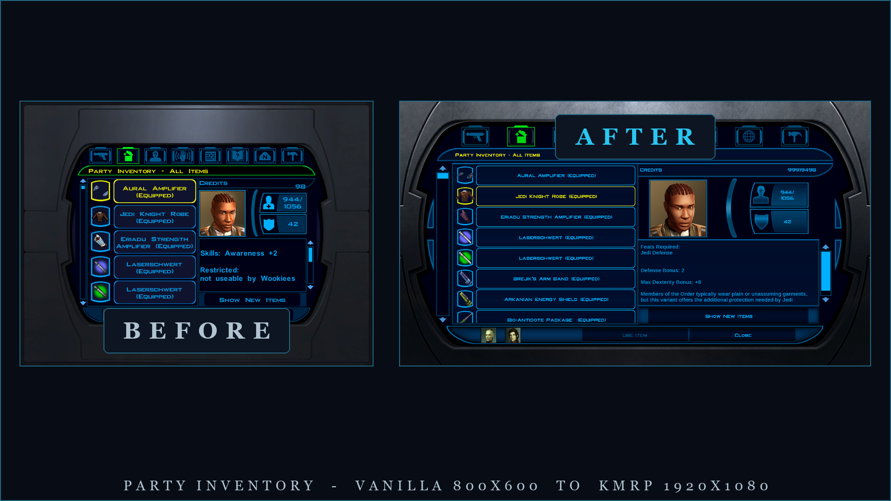
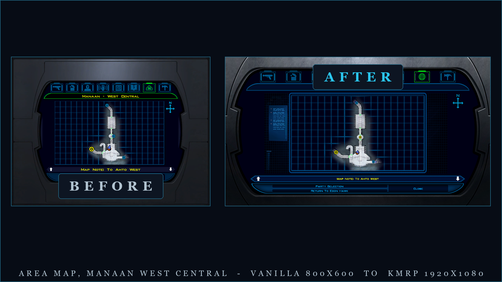
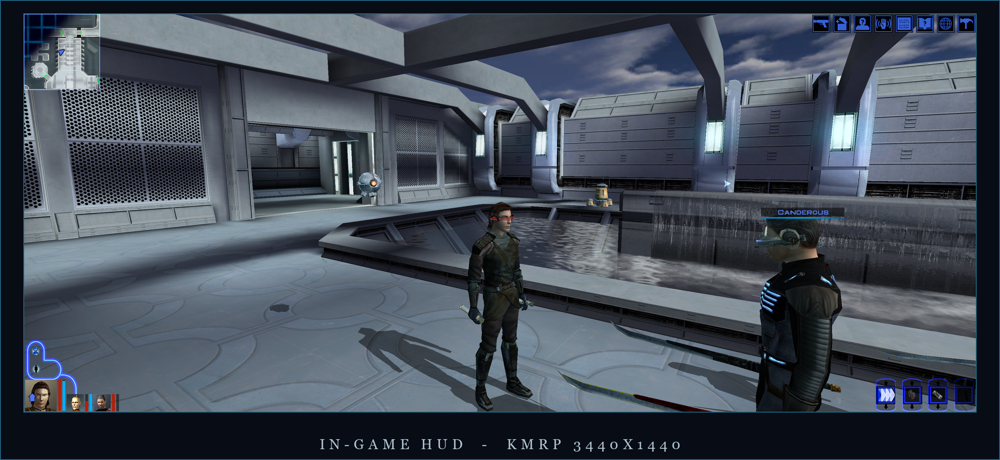

<div align="center">


# KMRP — KOTOR Modern Restoration Patch

**A resolution-aware interface patch for *Star Wars: Knights of the Old Republic* (2003).**

Vanilla KOTOR draws its interface at a fixed pixel size. On a modern display the
menus still work, but the text is tiny, list rows overlap once anything is
enlarged, and several layouts were only ever authored for 640×480. KMRP fixes
that in the engine itself rather than by swapping artwork — 66 resolutions, from
800×600 to 15360×8640.

[Install](#install) · [What it fixes](#what-it-fixes) · [How it works](#how-it-works) · [Build from source](#build-from-source) · [Documentation](#documentation) · [Case study](https://rayesdiyab.com/projects/kmrp/) · [Licence](#licence-and-attribution)

</div>

---

## Install

> [!IMPORTANT]
> KMRP patches a copy of your game executable in place. It is not a Steam
> Workshop item and there is no installer service — you run one program once.

**Requirements**

| | |
| --- | --- |
| Game | *Star Wars: Knights of the Old Republic* (2003 PC release) |
| `swkotor.exe` | The **4,042,752-byte** editable build, SHA-256 `761F9466…C49E9886`, or that exact build with only the standard Large Address Aware bit already set (`CA9D22EA…A7E1889`). KMRP refuses every other variant. |
| OS | Windows with .NET Framework 4.x (shipped with Windows 10/11). Linux/Proton and Steam Deck are experimental and not yet gameplay-verified; use the separate procedure below. |

1. Launch KOTOR once so `swkotor.ini` exists.
2. Run **`KMRP - KOTOR Modern Restoration Patch.exe`**.
3. Pick your resolution and choose **Start Patching**.
4. Restart KOTOR.

To change resolution later, use **Restore Original** first, then patch again.

**Linux / Proton / Steam Deck (experimental).** Launch the patcher inside the
game's Proton environment with `protontricks-launch --appid 32370`, and use the
same route for restore. Package-level Linux checks pass, but Proton gameplay and
physical-controller coverage are not yet complete. Follow the exact commands,
diagnostic steps, and honest test matrix in the
[Linux, Proton, and Steam Deck guide](docs/linux-proton-steam-deck.md).

**On the version number.** The first public release is **KMRP 1.0**,
published on 2026-09-04. On GitHub it is tagged
[v2.10.0](https://github.com/RayesDiyab/KMRP-KOTOR-Modern-Restoration-Patch/releases/tag/v2.10.0)
and titled "KMRP 2.10.0", its internal development number, and its
Properties → Details report 2.7.0.0, a mislabel. The build in progress is
**KMRP 1.5**, and its installer reports 1.5.0. The internal numbers appear in
[`CHANGELOG.md`](CHANGELOG.md):
- 2.0.0 to 2.9.x were private development builds;
- 2.10.0 is 1.0;
- 2.11.0 was this build's number until it was relabelled 1.5.0 on 2026-09-24.

One 2.0.0 build left the machine before 1.0. Its hash is recorded in
[`releases/universal-v2.0.0/`](releases/universal-v2.0.0/), so it can still be
identified. (Until 2026-09-24 this paragraph called v2.10.0 the first release,
said there was no v1, and said the numbering would not restart at 1.0.)

**What it touches, and how to undo it.** KMRP edits `swkotor.exe`, including
enabling its standard Large Address Aware flag, plus `swkotor.ini`
and the `Override` folder. It also marks that exact executable as DPI-aware in
the current user's Windows compatibility settings, preventing Windows display
scaling from enlarging an interface KMRP has already scaled. Before writing
anything it copies the executable and INI aside, records every Override file it
adds or replaces — with hashes — in `KOTOR_UI_Override_Backup.manifest`, and
records the prior DPI setting in `KMRP_DPI.manifest`. **Restore Original**
reverses each change from those records. If the DPI setting was changed after
KMRP installed it, restore leaves the newer setting alone. The patcher refuses
to run against an executable it does not recognise, and refuses to restore one
it did not create. See [Windows DPI handling](docs/windows-dpi-scaling.md).
The optional components below add their own files beside `swkotor.exe` -- the
ASI loader and driver-compatibility payload, and the controller runtime, module
and SDL -- each recorded in a manifest of its own (`KMRP_DriverCompat.manifest`,
`KMRP_Controller.manifest`) and removed on restore.

On NVIDIA, if the driver's global "Vulkan/OpenGL present method" prefers a DXGI
swap chain, KOTOR shows half-drawn frames -- a one-frame white flash in the
menus among them -- so the patcher sets **Prefer native** for `swkotor.exe` in
that case only, records it in `KMRP_NVIDIA.manifest`, and removes it again on
restore. A value set for the game on purpose is left alone. See
[NVIDIA present method](docs/nvidia-present-method.md).

<details>
<summary><b>Command line</b> (same operations, no window)</summary>

```
KMRP.exe --apply    <source.exe> <output.exe> [WIDTHxHEIGHT]
KMRP.exe --in-place <game.exe> [WIDTHxHEIGHT]
KMRP.exe --restore  <game.exe>
```

`--apply` writes a patched copy and leaves the original alone. Resolution
defaults to 3440×1440 when omitted.

</details>

---

## What it fixes

Every entry below was diagnosed against the executable, and each links to the
full trace. These are engine defects, not preferences — several are vanilla
BioWare bugs that only become visible once the interface is scaled.

| Symptom | Cause | Where |
| --- | --- | --- |
| **Text unreadably small** at high resolution | UI text renders at a fixed pixel size regardless of resolution | [font-scaling](docs/font-scaling.md) |
| **Inventory crash** on items with long descriptions | The line-breaker restarts an unbreakable line at the position it began at, comparing against the start of the *string* rather than the current *line* — it loops until the allocator fails | [font-atlases](reverse-engineering/font-atlases.md) |
| **List rows grow** every time a list is repopulated | `CAurGUIListBox` adds a row *count* to a row *height*, then writes the inflated rect back into reused controls. A vanilla bug, reproduced with an unmodified `.gui` | [listbox-geometry](reverse-engineering/listbox-geometry.md) |
| **Rows and icons stay vanilla-sized** | Row and icon sizes are hardcoded constants, unreachable from any `.gui` | [inventory-item-rows](reverse-engineering/inventory-item-rows.md) |
| **Stack-count numbers vanish** when the font grows | The label is built in the inventory row's `SetRect`, bottom-right-aligned inside the icon box, so scaling the icon leaves it behind | [inventory-item-rows](reverse-engineering/inventory-item-rows.md) |
| **Description text runs under the scrollbar** | The engine truncates each glyph advance and under-measures a line by ~3%; vanilla also left the listbox gutter at 0 on six panes | [listbox-geometry](reverse-engineering/listbox-geometry.md) |
| **Dialogue letterbox too small** on ultrawide | Bar height derived from screen *width* | [font-scaling](docs/font-scaling.md) |
| **HUD minimap not zoomed** to the player | The minimap pans the map under a centre-pinned marker with no clamping | [map](reverse-engineering/map.md) |
| **Message popups clipped** mid-word | An auto-fit loop widens the popup only while it is narrower than a cap authored for 640×480 | [message-popup](reverse-engineering/message-popup.md) |
| **HUD notifications oversized at 4K**, and **Feedback option circles on the scrollbar** | Short-lived HUD controls were scaled from screen width instead of the common height rule; the Feedback list drew each circle at the row's very edge, which is where its left scrollbar ends, and now keeps a gutter | [universal resolution math](docs/universal-resolution-math.md#reported-4k-layout-repairs) |
| **Out-of-memory failures near the 2 GB process ceiling** | The 32-bit executable did not declare that it can use addresses above 2 GB; KMRP now sets the standard PE Large Address Aware bit | [large-address-aware](reverse-engineering/large-address-aware.md) |
| **Movies trigger a 640×480 mode switch, minimize, or lose focus** | Full-screen Bink playback has two resolution pairs independent of the normal render size; KMRP writes the selected resolution into both | [movies](reverse-engineering/movies.md) |
| **Movies cropped** on wide screens — a 640×480 logo drawn 3440×2580 at 3440×1440 | Retail scales a movie by the screen *width* alone; KMRP fits it by whichever of width and height runs out first | [movies](reverse-engineering/movies.md) |
| **Map marker click offset** from where it is drawn | The hit test centred the map canvas in the window, while the control that crops it is placed by the marker overlay — 141px out horizontally | [map-markers](reverse-engineering/map-markers.md) |
| **Unfogged strip** down the right of the area map | The map picture is drawn onto a canvas wider than the overlay the fog grid covers, and nothing cropped the surplus | [area-map-surface](reverse-engineering/area-map-surface.md) |
| **250 map notes in the wrong place** | A 2003 content bug: the notes' stored world positions do not match their subjects | [map-markers](reverse-engineering/map-markers.md) |

---

## What it looks like

Vanilla on the left, KMRP on the right, both frames whole and uncropped.



Rows, icons and stack counts scale with the text, so the item list stops truncating
names and the description panel reads at a glance.



The map fills its frame, fog reaches the right edge, and the map note sits clear of
the buttons.

It holds at 21:9 as well — every resolution is generated from the same rules, not
hand-tuned one at a time:



More in [`assets/screenshots/`](assets/screenshots/).

---

## How it works

KMRP ships **one verified executable delta plus per-resolution resources**, not a
pile of loose file replacements.

```
 vanilla swkotor.exe ─┐
                      ├─►  gold snapshot  ──►  ResolutionPatch  ──►  your swkotor.exe
     gold delta ──────┘   (all engine fixes)   (rescales constants
     (embedded)                                 for your resolution)

     override-common.zip  ──┐
     gui-<resolution>.zip ──┴──►  Override/   (+ manifest for restore)
```

**The gold snapshot** is a reference executable carrying every engine fix, built
by the scripts in [`tools/`](tools/). The patcher embeds the *delta* between the
clean executable and that snapshot, verifies both hashes, and applies it. Engine
patches are added either as eleven new PE sections (`.kui`, `.klb`, `.kfs`,
`.kwl`, `.ksc`, `.kgs`, `.ktn`, `.kmz`, `.kfg`, `.kmn`, `.kmv`) holding
hand-written x86 stubs, or as in-place `imm32` rewrites. The patched executable
is 4,087,808 bytes at every resolution: the 4,042,752-byte original plus those
sections, with 742 byte positions of the original image changed at one
resolution or another — every one listed in
[reverse-engineering/binary-inventory.md](reverse-engineering/binary-inventory.md).

**Each interface file is stored once.** Most of the 66 resolutions' files are
the same bytes at several resolutions, so the installer embeds them as one pool
of distinct files, with an index per resolution. It rebuilds the chosen
resolution's set from the pool and checks every file against its hash. That
took the installer from 208,672,256 bytes to 145,208,320 (2026-09-25).

**One scaling rule, everywhere.** Font metrics, list rows, icon sizes and popup
geometry all scale by `max(1.0, height / 720)` — 1.00× at 720p, 1.50× at 1080p,
2.00× at 1440p, 3.00× at 2160p. The `.gui` files and the executable constants
are generated from that same rule so they cannot drift apart.

**Fonts are rendered, not shipped.** All 18 atlases are rasterised from vector
outlines at build time, once per resolution at that resolution's own scale, so
one atlas texel lands on one screen pixel and nothing is resampled. 15360×8640
is the one exception: its scale-12.0 atlas is larger than the baker can produce.
No font file is redistributed — see
[Licence and attribution](#licence-and-attribution).

---

## What else it installs

Alongside its own fixes, KMRP bundles work by other authors, each with that
author's permission. All of it is optional or deferential — none of it silently
overwrites a mod you installed yourself.

| Component | Author | Licence | Optional |
| --- | --- | --- | --- |
| [K1 Modern Driver Compatibility](https://codeberg.org/Synchro/kotor-modern-driver-compatibility) 1.2.0 | Synchro | MPL-2.0 | **Yes** — Advanced Settings |
| Area map marker corrections (250 notes) | Derslok | GPL-3.0 | **Yes** — Advanced Settings |
| Controller support, based on [KPM – Xbox Controls for KOTOR 1](https://github.com/scopeking0117-alt/KPM-Xbox-Controls-K1) 1.2 | Saul0097 / KMRP | MIT, inherited from KOTOR Patch Manager, with each author's permission (his own licence file pending); SDL zlib | **Yes, on by default** — Advanced Settings |
| Party Portraits | MadDerp | — | No |
| KOTOR 1 HD Icon Pack 1.0 | JackInTheBox | — | No |

**Advanced Settings**, the button beside *Start Patching*, controls all three
optional components. All three default to on, each can be turned off on its own,
and *Restore Defaults* turns all three back on. The choices are remembered in
`%LOCALAPPDATA%\KMRP\settings.json`.

**Updates.** When its window opens, the installer asks GitHub whether a newer
KMRP has been released. If one has, it offers the Deadly Stream page or a skip.
*Don't remind me again for* that version silences it, and only it. What the
request sends is in
[SECURITY.md](SECURITY.md).

**Driver compatibility** is two files dropped beside `swkotor.exe`; it never
edits the executable, and KMRP removes them on restore. What it changes, and the
check showing its eight patch sites do not collide with any of the 742 byte
positions KMRP's installer writes at any resolution, is in
[docs/third-party-driver-compat.md](docs/third-party-driver-compat.md).

**Controller support** uses that ASI loader plus a KOTOR Patch Manager runtime.
Xbox devices retain XInput; SDL3/HIDAPI supplies mapped non-Xbox devices to the
same normalized state. Input still travels through KOTOR's retained controller
events rather than synthetic keys. Options → Gameplay also gains a live
Controller Layout screen. Existing external `patch_config.toml` files are
preserved and block component installation. Exact files, mappings, hooks,
dynamic prompt families, layout screen, and the remaining hardware/Proton test
matrix are in [docs/controller-support.md](docs/controller-support.md) and
[docs/controller-layout.md](docs/controller-layout.md).

**The bundled artwork yields.** A portrait or icon already present in `Override`
that KMRP did not put there is left alone — so a content mod that ships the same
file keeps its own version. KMRP's own interface files always install.

**Tested against** KOTOR 1 Community Patch 1.10.0 and KOTOR 1 Restoration 1.2:
neither ships `.gui` files, neither touches `swkotor.exe`, and neither patches
`tutorial.2da`, the only 2DA KMRP ships. K1CP replaces two icons the HD Icon Pack
also provides; those now defer to it. **Install other content mods first, then
KMRP** — KMRP records and restores whatever it replaces, whereas a mod installed
afterward can invalidate that record. Do not also install UniWS, High Resolution
Menus, or a separate 4 GB patch. KOTORganizer users should finish Sync and then
run KMRP manually against the real game folder; see the full
[mod-build compatibility and install-order guide](docs/mod-build-compatibility.md).

---

## Build from source

Building is only needed to develop KMRP; players just run the released
executable.

**Prerequisites**

- Windows with .NET Framework 4.x (`csc.exe` from `v4.0.30319`)
- Python 3 with `pykotor`, and `Pillow` + `numpy` for the asset tools
  (`pip install -r requirements.txt`)
- Visual Studio Build Tools (MSVC, x86) for the controller module
- Network access on the first build: `tools/prepare_sdl3.ps1` downloads the
  pinned SDL 3 SDK into `build/deps` and checks its hash
- Two files from your own copy of the game, placed in
  [`build-inputs/`](build-inputs/README.md) — a clean `swkotor.exe`
  (SHA-256 `761F9466…`, verified by the build) and `TexturePacks/swpc_tex_gui.erf`

```powershell
.\build_kmrp.ps1
```

That regenerates all 66 resource archives and compiles the patcher to
`dist/`. Add `-ReuseResources` to skip resource generation and only recompile.

**A fresh clone needs three generated inputs first**, none of them committed:

- the gold snapshot, `build/kmrp/swkotor_gold_v24_movieaspect.exe`, rebuilt from
  the clean executable by the chain of tools tabulated in
  [docs/font-scaling.md](docs/font-scaling.md), each step's output hash recorded
  there;
- the controller module, `src/controller-native/kmrp-controller.module`, from
  `src\controller-native\build.cmd`;
- optionally, the per-resolution font sets in `build/fonts`, from
  `tools/build_font_scale_sets.py`. Without them the build warns and every
  resolution falls back to the shared atlas.

**The project folder is self-contained.** Everything the build reads lives
inside it, so the folder can be moved or copied anywhere. Only the two
game-derived files above have to be supplied from outside, and they are never
committed. (This section said those two files were all a build needed until
2026-09-24; the three above are generated inside the folder but are not in
the repository.)

> [!NOTE]
> **Game binaries and game resources are never committed.** `.gitignore` blocks
> `*.exe`, `*.erf`, `*.bif`, `*.key` and friends. The gold snapshots live only on
> the build machine; the chain of hashes that identifies them is recorded in
> [docs/font-scaling.md](docs/font-scaling.md) so any of them can be rebuilt and
> verified.

See [CONTRIBUTING.md](CONTRIBUTING.md) for the working rules this project holds
itself to — verifying before and after every executable edit, measuring rather
than eyeballing, and recording what was disproved alongside what worked.

---

## Repository layout

```
.github/              CI workflow, issue and pull request templates, Dependabot
assets/               Build inputs
  branding/           Logo, favicon, and the patcher's UI icons
  fonts/  hd-fonts/   Font sources and the rendered atlases
  override-*/         GUI layouts and artwork installed into the game
docs/                 Build and design documentation
reverse-engineering/  Engine analysis, one document per subsystem
  patch-records/      Machine-readable descriptions of confirmed patches
src/patcher/          The Windows patcher application (C#)
src/controller-native/ The controller module (C++), loaded by KOTOR Patch Manager
tools/                Python tools that build the gold snapshot and resources
testing/              Regression tests, controller harnesses, virtual-display profiles
build-inputs/         Files from your own game copy (never committed)
third_party/          Upstream inputs: GUI layouts, bundled mods, glyph art, a font
archive/              Superseded assets, kept only for reference
releases/             Notes and hashes for past releases
```

## Documentation

| | |
| --- | --- |
| [docs/](docs/) | Build and design documentation — start at [docs/README.md](docs/README.md) |
| [reverse-engineering/](reverse-engineering/) | Engine analysis, one document per subsystem — index at [reverse-engineering/README.md](reverse-engineering/README.md) |
| [CHANGELOG.md](CHANGELOG.md) | What changed, per release |
| [THIRD_PARTY_NOTICES.md](THIRD_PARTY_NOTICES.md) | Upstream work this builds on, and the licensing position |

The reverse-engineering notes are written to be read by someone who was not
there: they record the addresses, the measurements, and — deliberately — the
theories that turned out to be **wrong**, so the same dead ends are not explored
twice.

---

## Licence and attribution

KMRP is distributed under the **GNU General Public License v3.0** — see
[LICENSE](LICENSE). The per-resolution GUI layouts derive from *KOTOR High
Resolution Menus 1.5* by **ndix UR**, which is GPL-3.0, and that licence carries
forward.

It also redistributes, with permission: **K1 Modern Driver Compatibility** by
**Synchro** (MPL-2.0), the map-note correction table from **K1 Area Map Fixes** by
**Derslok** (GPL-3.0), **Party Portraits** by **MadDerp**, the **KOTOR 1 HD
Icon Pack** by **JackInTheBox**, and the controller module built on
**Saul0097**'s KPM Xbox Controls with the **KOTOR Patch Manager** runtime (MIT).
The driver files, the note table and the portraits ship unmodified; the 351
icons are downscaled from 192 to 160 px and compressed to DXT5 at build time.
**SDL 3** (zlib) ships unmodified with its licence.

Interface artwork derives from the HD menu/UI asset set used in **RaymanGT**'s
3440×1440 release. Full credits, links, and the reasoning behind each decision
are in [THIRD_PARTY_NOTICES.md](THIRD_PARTY_NOTICES.md) — including one
**unresolved** point recorded honestly: the *Old Republic* typeface used for
menu text is marked "free for personal use" by its author, who states it cannot
be licensed further because it reproduces someone else's intellectual property.
KMRP embeds rendered glyph atlases rather than the font file, ships only to
people who already own the game, and the position on record is to remove it if
Lucasfilm objects. **If you redistribute KMRP, that point is yours to weigh.**

*Star Wars: Knights of the Old Republic* is © 2003 BioWare Corp. / LucasArts.
This is an unofficial community patch, not affiliated with or endorsed by
BioWare, LucasArts, Lucasfilm, or Disney. You must own the game.
